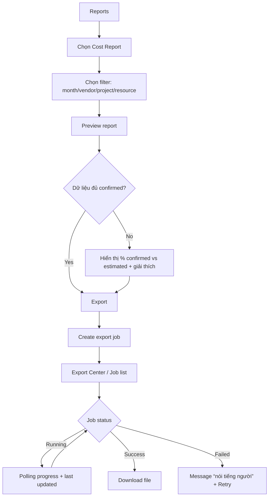

# UX Design Specification project-management

**Author:** HieuTV-Team-Project-Management
**Date:** 2026-04-25

---

<!-- UX design content will be appended sequentially through collaborative workflow steps -->

## Executive Summary

### Project Vision

`project-management` là web application nội bộ (Angular SPA) thay thế Excel để quản lý lực lượng lao động hỗn hợp (inhouse + outsource nhiều vendor) trên nhiều dự án. Trải nghiệm cốt lõi là giúp PM “nhìn nhanh – quyết nhanh – chỉnh nhanh” trên một nguồn dữ liệu tập trung: lập kế hoạch trên Gantt, phát hiện overload theo giờ, ghi nhận timesheet đa tầng, đối chiếu chi phí theo vendor và xuất báo cáo tức thì.

Sản phẩm ưu tiên “đủ đúng để thay Excel” hơn là nhiều tính năng nửa vời: luồng lập kế hoạch và vận hành phải mượt, rõ ràng, và có audit trail.

### Target Users

- **Primary**: Project Manager nội bộ (~20 người dùng) quản lý nhiều dự án song song, cần điều phối nguồn lực và theo dõi tiến độ/chi phí theo thời gian thực.
- **Secondary**: Quản lý cấp cao (xem dashboard/báo cáo), Admin (quản trị tài khoản + cấu hình ngày lễ), và các vai trò liên quan vendor (tuỳ scope theo phase).

### Key Design Challenges

- **Gantt interaction nặng nhưng phải ổn định**: split-panel (tree + timeline), drag/resize/link, zoom/scroll; yêu cầu phản hồi nhanh và không “giật” khi dữ liệu refresh.
- **Concurrency + polling**: kiến trúc dùng polling (30–60s) và optimistic locking (ETag/If-Match) nên UX phải xử lý 409/412 (conflict) và cập nhật nền mà không phá thao tác đang chỉnh sửa.
- **Timesheet grid “Excel-like” nhưng đúng dữ liệu**: nhập theo tuần/ngày, hỗ trợ copy/paste, validation (16h/day cap, >20% deviation note), và trạng thái dữ liệu (estimated / pm-adjusted / vendor-confirmed).
- **Overload phải actionable**: cảnh báo overload (8h/day, 40h/week) và predictive traffic-light phải dẫn người dùng đến đúng nơi cần xử lý (task/time range/resource), không chỉ hiển thị màu.

### Design Opportunities

- **Morning check tối ưu cho PM**: landing “My Projects/Overview” hiển thị rủi ro (overload/overdue) và cho phép jump 1-click vào đúng project/Gantt/task cần chỉnh.
- **Capacity-first decisioning**: kết hợp heatmap capacity + predictive overload để PM nhìn trước bottleneck, giảm “chữa cháy”.
- **Reporting + Export center rõ ràng**: xuất báo cáo async (PDF/Excel) với job progress, retry và thông báo lỗi “nói tiếng người” (ProblemDetails → message hành động được).

## Core User Experience

### Defining Experience

Core loop của `project-management` gồm 3 hành động lặp lại thường xuyên:

1) **Re-plan trên Gantt (primary loop)**  
Mở Gantt là “tức thì”, kéo/resize là “mượt như bơ”: trong lúc kéo có preview rõ (ghost bar + tooltip ngày), thả xong thì ổn định và đáng tin (không giật/nhảy). Mọi thay đổi được phản hồi trực quan ngay trong lúc thao tác, và được đồng bộ an toàn (có trạng thái saving/saved/failed).

2) **Nhập giờ theo tuần (operational loop)**  
Nhập timesheet theo tuần bằng grid “Excel-like”: bàn phím là chính; copy/paste + fill down nhanh; lỗi hiển thị ngay tại ô nhưng không phá nhịp nhập. Dữ liệu đủ tin cậy để dùng cho overload/cost/report.

3) **Xem overload & xử lý (risk loop)**  
Nhìn overload là ra quyết định ngay trong 1 ngữ cảnh: thấy nguyên nhân (ai/việc nào/time-range nào), chọn hành động (đẩy lịch/đổi người/giảm scope) và xác nhận thay đổi mà không phải “đi lòng vòng” qua nhiều màn hình.

Khoảnh khắc “đúng cái mình cần” là khi PM có **tầm nhìn tổng thể** để quản lý **dự án, con người và tiến độ** trên một nơi duy nhất, thay vì nhiều Excel rời rạc.

### Platform Strategy

- **Platform**: Web application nội bộ, ưu tiên desktop.
- **Input method**: mouse + keyboard (power-user); ưu tiên thao tác nhanh và phím tắt ở các màn hình dạng grid/Gantt.
- **Offline**: không yêu cầu trong MVP.
- **Make-or-break**: Gantt không được lag/giật trong drag/resize và khi dữ liệu refresh (polling). Nếu fail, user quay lại Excel.

### Effortless Interactions

Các thao tác phải “mượt như Excel” ngay từ MVP:

- **Timesheet grid**
  - Copy/paste nhiều ô + fill down có kiểm soát.
  - Điều hướng bàn phím Tab/Enter/Esc, Arrow/Shift+Arrow (range selection) rõ “focus cell” vs “selection range”.
  - Paste lớn: vẫn paste được, validate theo ô và hiển thị lỗi inline (không chặn nhịp), có khả năng undo nhanh.

- **Gantt / tree grid**
  - Inline edit các field chính (tối thiểu: tên task, ngày kế hoạch) không mở form rườm rà.
  - Drag/resize phản hồi tức thì; commit theo “thả chuột” (pointer up / drop), không spam.
  - Auto-scroll khi kéo gần mép timeline; highlight ngữ cảnh (row/task đang kéo + dependency liên quan), giảm nhiễu.

### Critical Success Moments

- **Gantt buttery**: kéo/resize có preview rõ, thả xong không nhảy; save/retry/conflict không làm “mất nhịp”.
- **Timesheet Excel-like**: nhập tuần nhanh, copy/paste/fill-down; lỗi rõ ngay tại ô; totals cập nhật nhanh.
- **Overload actionable**: click cảnh báo là đi đúng điểm cần chỉnh, không chỉ hiển thị màu.

### Experience Principles

- **Time-to-Answer nhanh**: mở lên là trả lời được “đang ở đâu, rủi ro gì, cần quyết gì”.
- **Excel-like thao tác, nhưng an toàn hơn**: nhanh (grid/Gantt) + có validation/audit/state rõ.
- **Không mất niềm tin**: không silent overwrite; lỗi/conflict phải có đường thoát rõ ràng.
- **Actionable warnings**: overload/predictive phải dẫn tới hành động cụ thể.
- **Hiệu năng là tính năng**: ưu tiên cảm giác mượt cho Gantt và grid.

### Gantt Smoothness Guardrails (UX requirements)

- Polling không được làm giật layout, đổi vị trí scroll, nhảy zoom/time-axis, hoặc teleport task khỏi mắt người dùng.
- Không áp polling lên task đang được user chỉnh; thay đổi từ server liên quan task đó phải được “defer” và thông báo ngắn gọn.
- Khi conflict optimistic locking (409/412), UI giữ nguyên thao tác user đã thấy, và cung cấp lựa chọn giải quyết tối giản theo ngữ cảnh; không được silent rollback.
- Cập nhật từ user/polling phải theo nhịp ổn định (batch), tránh flicker; ưu tiên render vùng đang nhìn (viewport-first).
- Mọi thao tác kéo/thả phải phản hồi tức thì và có trạng thái đồng bộ nhẹ (per-item), không khóa toàn màn hình.

### Measurable UX Acceptance (MVP)

- **Gantt**
  - Drag/resize bắt đầu phản hồi trong ≤ 1 frame cảm nhận (không có freeze >100ms khi thao tác).
  - Commit gọi API đúng 1 lần / 1 lần thả; có trạng thái saving/saved/failed rõ.
  - `Esc` hủy thao tác đang kéo và revert trong <100ms.
- **Timesheet grid**
  - Vào edit-in-cell <100ms; keyboard nav mượt (<50ms cảm nhận).
  - Paste vùng lớn không freeze; validate hiển thị lỗi nhanh tại ô; không gửi API khi còn lỗi.
  - Batch save theo debounce; khi user dừng nhập thì lưu trong ≤2s (trạng thái lưu rõ ràng).

## Desired Emotional Response

### Primary Emotional Goals

- **Kiểm soát (In control)**: PM luôn cảm thấy mình đang nắm “bức tranh tổng thể” (dự án – con người – tiến độ) và có thể ra quyết định nhanh dựa trên dữ liệu hiện tại.
- **Yên tâm (Peace of mind)**: hệ thống đáng tin; thay đổi được lưu/đồng bộ rõ ràng; không sợ mất dữ liệu; không sợ “không biết hiện tại đúng hay sai”.

### Emotional Journey Mapping

- **Lần đầu mở sản phẩm**: cảm giác “đây là trung tâm điều hành” (có tầm nhìn), không bị choáng bởi quá nhiều thứ.
- **Trong core loop (Gantt / timesheet / overload)**: tập trung, chắc tay; thao tác mượt, phản hồi tức thì; trạng thái lưu/đồng bộ rõ ràng.
- **Sau khi hoàn thành**: cảm giác “mình đã kiểm soát được dự án, con người, tiến độ” và có bằng chứng (report/audit) để tự tin báo cáo.
- **Khi quay lại dùng tiếp**: tin tưởng rằng dữ liệu vẫn nhất quán, không cần kiểm tra chéo Excel.

### Micro-Emotions

- **Cần tối đa hóa**
  - **Tự tin** (confidence): biết chắc hệ thống đang ở trạng thái nào (đã lưu/chưa lưu/đang đồng bộ).
  - **Tin tưởng** (trust): số liệu và thay đổi có nguồn gốc, truy vết được (audit), không “tự nhiên đổi”.
  - **Bình tĩnh** (calm): cảnh báo overload rõ ràng và có cách xử lý ngay.

- **Cần tránh**
  - **Hoang mang** vì UI/luồng xử lý mơ hồ.
  - **Mất niềm tin** vì dữ liệu nhảy/lag/không nhất quán.
  - **Sợ mất dữ liệu** khi conflict/network/job fail.

### Design Implications

- **Không bao giờ “bắt user hiểu HTTP code”**:
  - Lỗi phải là ngôn ngữ người dùng + nguyên nhân đơn giản + hành động tiếp theo (retry, tải lại, xem khác biệt).
- **Bảo toàn cảm giác kiểm soát khi có sự cố**:
  - Conflict (409/412) phải giải thích theo “dữ liệu đã đổi vì có người khác cập nhật”, không dùng thuật ngữ kỹ thuật.
  - Không silent rollback; luôn có trạng thái “đang lưu/đã lưu/lưu thất bại” và cách phục hồi.
- **Giảm sợ mất dữ liệu**:
  - Khi thao tác chưa lưu: hiển thị “dirty state” rõ; có confirm khi rời màn hình.
  - Khi lỗi mạng: giữ thay đổi local (nếu có thể) và hướng dẫn retry.
- **Củng cố niềm tin bằng minh bạch nhẹ**:
  - “Last updated”, job progress, audit trail: cung cấp bằng chứng nhưng không làm nặng UI.

### Emotional Design Principles

- **Clarity over codes**: thông điệp rõ ràng, tránh thuật ngữ kỹ thuật.
- **Trust by design**: trạng thái đồng bộ rõ + audit trail + không mất dữ liệu.
- **Calm under failure**: lỗi có đường thoát, không hoảng.
- **Control is the product**: mọi màn hình/interaction phải phục vụ “PM đang kiểm soát”.

## UX Pattern Analysis & Inspiration

### Inspiring Products Analysis

#### Jira

- **Grid mượt + thao tác nhanh**: bảng issue/task cho phép chỉnh/đổi trạng thái nhanh theo ngữ cảnh, giảm “đi form”.
- **Filter/search mạnh**: người dùng tin rằng “mình sẽ tìm ra thứ cần tìm trong vài giây”, không phải lục nhiều nơi.
- **View tổng quan theo nhu cầu**: backlog/board/list/report giúp trả lời nhanh “đang ở đâu” và “cái gì cần chú ý”.
- **Đảm bảo nghiệp vụ**: trạng thái/transition rõ ràng → giảm nhập sai và tạo niềm tin dữ liệu.

Bài học áp dụng cho `project-management`:

- Timesheet và danh sách task nên có **grid-first**, thao tác nhanh, ưu tiên keyboard.
- Filter/search phải xuất hiện “đúng lúc” và không làm gián đoạn thao tác (đặc biệt khi dataset lớn).
- State machine (timesheet status / task status) phải rõ ràng để tạo “yên tâm”.

#### Microsoft Project

- **Gantt là trung tâm điều hành**: split-view (task list + timeline) giúp “có tầm nhìn” và ra quyết định nhanh.
- **Drag/resize trực tiếp trên timeline**: chỉnh kế hoạch theo cảm giác, ít bước, phản hồi tức thì.
- **Tổng quan tiến độ & phụ thuộc**: dependency/critical path giúp nhìn rủi ro và nguyên nhân trễ.
- **Tính nghiêm túc nghiệp vụ**: ngày/độ dài/phụ thuộc có ràng buộc rõ → người dùng tin kết quả.

Bài học áp dụng cho `project-management`:

- Gantt phải “buttery” và ổn định (không giật/nhảy) vì đây là make-or-break.
- Split-view cần tối ưu cho quyết định nhanh: highlight phụ thuộc liên quan khi thao tác, preview rõ khi kéo.
- Cảnh báo/constraint nên “nhẹ nhưng chắc”: báo ngay, giải thích ngắn, có cách xử lý.

### Transferable UX Patterns

- **Grid-first, keyboard-first** (từ Jira) → áp cho Timesheet grid và tree grid của Gantt.
- **Fast filter/search** (từ Jira) → filter theo project/person/time-range, không lag, có empty-state rõ (không khiến user hoang mang).
- **Split-view control center** (từ MS Project) → Gantt view: tree + timeline + detail drawer, giữ ngữ cảnh khi edit.
- **Constraint feedback in-context** (từ MS Project) → cảnh báo dependency/overload hiển thị ngay tại nơi thao tác, không pop-up làm đứt mạch.
- **State clarity = trust** (từ Jira) → status/transition rõ, audit + last updated giúp “yên tâm”.

### Anti-Patterns to Avoid

- **Form-heavy workflow**: bắt user click qua nhiều dialog để làm việc thường xuyên → phá nhịp “Excel-like”.
- **Filter chậm / tìm không ra**: làm user quay lại Excel vì “tìm trong Excel còn nhanh hơn”.
- **Gantt giật khi refresh**: mất niềm tin ngay lập tức vì người dùng cảm giác “mình không kiểm soát”.
- **Thông báo lỗi kỹ thuật (HTTP code)**: tạo cảm giác khó hiểu/hoang mang; cần message theo ngôn ngữ người dùng.

### Design Inspiration Strategy

- **What to Adopt**
  - Grid-first + keyboard-first (Jira) để đạt tốc độ thao tác và giảm ma sát.
  - Split-view Gantt control center (MS Project) để tạo cảm giác kiểm soát và tầm nhìn tổng thể.

- **What to Adapt**
  - Jira filters/search: rút gọn theo nhu cầu nội bộ, nhưng giữ tốc độ và sự rõ ràng.
  - MS Project constraints: giữ ràng buộc cốt lõi (dependency/overload) nhưng trình bày nhẹ, tránh “nặng học thuật”.

- **What to Avoid**
  - UI nhiều bước/không ổn định khi polling.
  - Error messaging kỹ thuật; ưu tiên “Clarity over codes” để giữ cảm xúc yên tâm.

## Design System Foundation

### 1.1 Design System Choice

Chọn **Established Design System: Angular Material** làm nền tảng UI cho `project-management` (internal tool), với **light theme** và **token hoá** để đồng bộ trải nghiệm.

Phân tách rõ:

- **Material for “chrome”**: app shell (navigation/toolbar), form/filter, dialog/drawer, notifications, empty/loading/error states.
- **Bryntum & custom work-surface for “canvas”**: vùng Gantt/grid (cell rendering, virtualization, inline editor, selection model). Tránh nhúng Material component trực tiếp vào cell.

### Rationale for Selection

- **Tốc độ triển khai**: internal tool cần ship nhanh, giảm effort tự build UI nền.
- **Nhất quán & yên tâm**: pattern đã “battle-tested”, hỗ trợ trạng thái rõ ràng → tăng cảm giác **kiểm soát** và **yên tâm**.
- **Phù hợp power-user**: dễ tiêu chuẩn hoá “grid-first, keyboard-first”, phục vụ trải nghiệm kiểu Excel.
- **Maintainability**: phù hợp team 3–4 dev; giảm drift UI.

### Implementation Approach

- Dùng Angular Material/CDK cho:
  - Layout & navigation (app shell)
  - Form controls, filter bars, dialogs/drawers
  - Menus/context menus (quy tắc thống nhất)
  - Snackbars/banners/toasts theo taxonomy lỗi
- Với vùng work-surface (Gantt/timesheet grid):
  - Renderer/editor/virtualization thuộc Bryntum hoặc custom grid layer
  - Material chỉ bao quanh (toolbar, filter panel, detail drawer, conflict dialog)

### Customization Strategy

#### Token layer (bắt buộc)

Thiết lập “token map” dùng chung để đồng bộ Material + Bryntum + UI custom:

- Color tokens: surface/border/text, primary/secondary, semantic (success/warn/error/info), overload severities
- Typography tokens: body/grid/header/title + số dạng tabular nếu cần
- Spacing tokens: 4/8/12/16 rhythm
- Density tokens: compact/cozy/comfortable
- Motion tokens: duration/easing (tránh animation nặng trong grid)

Quy tắc: **không hardcode màu/spacing rải rác trong features** (tránh drift).

#### Density model (để “Excel-like”)

Định nghĩa 3 mức density:

- **Compact**: mặc định cho grid + Gantt
- **Cozy**: cho form/filter/settings
- **Comfortable**: cho màn hình review/onboarding

Mục tiêu: information density cao nhưng vẫn rõ ràng, giảm scroll, tăng cảm giác kiểm soát.

#### Overlay governance (tránh xung đột popup)

Chuẩn hoá layering giữa Material CDK overlay và Bryntum popups:

- Popup/editor “trong grid” ưu tiên theo cơ chế của grid/Bryntum
- Dialog workflow (conflict resolution, destructive confirm) dùng Material
- Có quy ước z-index scale để tránh bị che/backdrop sai

### Maintainability & Performance Guardrails (Do / Don’t)

- **Do**
  - Dùng Material qua API công khai + theme tokens/mixins
  - OnPush mặc định; tránh render component nặng trong cell
  - Wrapper layer cho pattern dùng lại (button/dialog/form-field) để giữ consistency
  - Virtualization-first cho danh sách/grid lớn

- **Don’t**
  - Không override sâu theo DOM nội bộ MDC, không `::ng-deep` như giải pháp mặc định
  - Không nhúng `mat-select/mat-menu/mat-tooltip` trong từng cell của grid lớn
  - Không hardcode màu/spacing; tránh “mỗi feature một style”

## 2. Core User Experience

### 2.1 Defining Experience

**Defining experience** của `project-management` là:

> **Kéo-thả trên Gantt để re-plan kế hoạch và thấy ngay tác động (tiến độ + overload), sau đó trạng thái được lưu rõ ràng (“saved state”).**

Đây là tương tác mà người dùng sẽ mô tả ngắn gọn như “MS Project nhưng dành cho quản lý mixed-workforce multi-vendor, có overload theo giờ”.

### 2.2 User Mental Model

- **Hiện tại**: người dùng đang làm việc này bằng **Excel** (nhiều sheet/file), nhưng trải nghiệm re-plan trên Excel **khó dùng** và khó tin cậy (dễ sai, khó nhìn tổng thể, thiếu “feel” kéo-thả theo timeline).
- **Kỳ vọng mang theo** (từ MS Project/Jira):
  - **MS Project**: split-view (task list + timeline), kéo-thả trực tiếp để đổi ngày/duration, nhìn phụ thuộc.
  - **Jira**: grid thao tác nhanh, filter/search mạnh, view tổng quan theo nhu cầu.

Vì vậy UX cần vừa “quen tay” (established pattern), vừa đảm bảo cảm giác **kiểm soát** và **yên tâm** (saved state + độ chính xác).

### 2.3 Success Criteria

Người dùng nói “this just works” khi:

- **Dễ nhìn & dễ hiểu**: mở Gantt là thấy bức tranh tổng thể; kéo-thả/resize phản hồi tức thì, không giật.
- **Đánh giá tốt / ra quyết định nhanh**: sau vài thao tác, PM biết kế hoạch mới có hợp lý không (rủi ro, phụ thuộc, overload).
- **Độ chính xác dữ liệu cao**: “saved state” rõ ràng; dữ liệu không nhảy/không mơ hồ; không silent overwrite; nếu có xung đột/refresh thì giải thích được.

### 2.4 Novel UX Patterns

- **Phần lớn là established patterns** (MS Project-style Gantt + Jira-style grid/filter).
- “Unique twist” (khác biệt theo domain) nằm ở:
  - **Overload theo giờ** và **predictive traffic-light** được đưa vào ngữ cảnh re-plan (để PM không chỉ kéo theo timeline mà còn kéo theo capacity reality).
  - **Saved state / trust cues** được nhấn mạnh (để thay Excel bằng “single source of truth”).

### 2.5 Experience Mechanics

**1) Initiation**

- Entry point: **My Projects** → chọn dự án → mở **Gantt**.

**2) Interaction**

- Người dùng re-plan bằng:
  - Kéo task trên timeline để đổi ngày.
  - Resize để đổi duration.
  - Inline edit ở tree/grid cho field cốt lõi (tên/ngày kế hoạch…) khi cần.
  - Dùng filter/search để tập trung vào đúng phạm vi (theo task/person/time-range) khi dataset lớn.

**3) Feedback**

- Trong lúc thao tác:
  - Preview rõ ràng (vị trí/ngày) và bối cảnh liên quan (highlight row/dependency, overload cue khi cần).
- Sau thao tác:
  - Trạng thái **saved state** rõ ràng (đã lưu/đang lưu/lưu thất bại) theo đúng nguyên tắc “Clarity over codes”.
  - Nếu có conflict hoặc dữ liệu thay đổi: giải thích theo ngôn ngữ người dùng, giữ cảm giác kiểm soát.

**4) Completion**

- Người dùng biết “done” khi thấy **saved state** và kế hoạch mới phản ánh đúng trên Gantt/overview (không cần kiểm tra chéo Excel).

## Visual Design Foundation

### Color System

**Brand direction:** Đen / Trắng / Xanh kiểu Docker → ưu tiên cảm giác **kiểm soát** và **yên tâm** (ít màu, rõ trạng thái).

**Base neutrals**

- Background: White / Near-white
- Surface: White
- Text: Near-black
- Borders/dividers: Neutral gray (nhẹ)

**Primary**

- Primary (Docker blue): #2496ED
- Primary-hover/darker: (darker tone của primary để dùng cho hover/active)
- Primary-contrast: White

**Semantic colors (để “Clarity over codes”)**

- Info: dùng tông xanh (primary) hoặc blue-info riêng (nếu cần phân biệt)
- Success: green (dịu, không neon)
- Warning/At-risk: amber (dịu)
- Error: red trầm (không chói)

**UX rules**

- Trạng thái quan trọng không chỉ dựa vào màu: luôn có label/icon/tooltip.
- Overload traffic-light phải dùng tone “dịu” (không gắt) để giữ cảm xúc bình tĩnh.
- Conflict/sync states ưu tiên: text rõ + icon + trạng thái (Saved/Saving/Not saved), không dùng “mã lỗi”.

### Typography System

**Font**: Roboto (mặc định Material), ưu tiên readability và nhất quán.

**Type scale tối giản (thiên về data-dense UI)**

- Page title: 18–20px (semibold)
- Section title: 14–16px (semibold)
- Body: 13–14px
- Grid/Gantt text (compact): 12–13px
- Column header: 12px (semibold)

**Data readability**

- Số liệu (hours/cost/%) ưu tiên tabular/lining numbers nếu khả thi để cột thẳng hàng.
- Quy tắc align: số right-align, text left-align, status center.

### Spacing & Layout Foundation

**Spacing rhythm**: 4/8/12/16 (khớp với token layer ở Design System Foundation).

**Density tiers (áp dụng nhất quán)**

- Compact: grid + Gantt
- Cozy: forms/filters/settings
- Comfortable: review/onboarding

**Layout principles**

- Ưu tiên “information density có kiểm soát”: ít scroll, nhiều dữ liệu nhưng vẫn rõ ràng.
- Sticky header/columns cho grid; Gantt có sticky time header + today line.

### Accessibility Considerations

- Đảm bảo contrast đủ (đặc biệt text trên primary blue).
- Không dùng màu là kênh duy nhất cho cảnh báo (overload/conflict/error).
- Focus ring rõ ràng cho keyboard-first (grid/Gantt) để power-user không bị “mất điều khiển”.

## Design Direction Decision

### Design Directions Explored

Đã tạo và review các hướng thiết kế (D1–D8) trong `ux-design-directions.html` dựa trên nền visual Docker (đen/trắng/xanh), Material cho chrome và work-surface cho Gantt/grid.

### Chosen Direction

**Chọn D1 — Control Center (Balanced)**.

**Key element được chốt**:

- **Split-view Gantt** (tree/grid + timeline) là “work surface” trung tâm để re-plan: ưu tiên cảm giác kiểm soát, thao tác nhanh, và saved state rõ.

### Design Rationale

- D1 phù hợp mục tiêu cảm xúc **Kiểm soát / Yên tâm**: tập trung vào “control center” và work-surface cho việc re-plan.
- Split-view Gantt bám mental model MS Project, đồng thời vẫn đủ “chrome” để áp các pattern Jira-like (filter/search, view presets) ở các bước thiết kế màn hình sau.

### Implementation Approach

- **Material** dùng cho app shell + toolbar/filter/drawer/dialog + notifications.
- **Bryntum/custom work-surface** cho split-view Gantt và các tương tác drag/resize/inline edit (ưu tiên buttery + không giật khi polling).
- Các trust cues (saved/last updated, conflict messaging “Clarity over codes”) áp nhất quán trong D1.

## User Journey Flows

### Journey 1 — PM: Morning check (Happy Path)

**Mục tiêu:** Trong 30–60 giây, PM có tầm nhìn tổng quan (dự án – con người – tiến độ) và jump vào đúng điểm cần chỉnh trên Gantt.

**Entry:** Login → (Role=PM) Dashboard tổng quan

```mermaid
flowchart TD
  A[Login] --> B{Role = PM?}
  B -- No --> C[My Projects]
  B -- Yes --> D[Dashboard tổng quan]

  D --> D1[Polling refresh + Last updated]
  D --> E{Có cảnh báo?}

  E -- Overload --> F[Click Overload card / banner]
  F --> G[Overload Drill-down (list người + time-range + nguyên nhân)]
  G --> H[Open Project Gantt (split-view) + highlight đúng task/time-range]
  H --> I[Re-plan: drag/resize/inline edit]
  I --> J[Saved state: Saving→Saved]
  J --> K[Return to Dashboard (optional) / Continue planning]

  E -- Overdue/Cascade --> L[Click Late/Blocked]
  L --> H

  E -- Không có --> M[Open My Projects / chọn project]
  M --> H
```

**Error/Recovery paths (mấu chốt cảm xúc “yên tâm”):**

- 401 → “Phiên đã hết hạn. Đăng nhập lại để tiếp tục.”
- 404 membership-only → “Không tìm thấy dự án (có thể bạn không có quyền)” + CTA về My Projects.
- Polling fail → banner “Không thể làm mới. Thử lại” (không chặn thao tác).
- 409/412 khi lưu → conflict dialog “Dữ liệu đã được cập nhật ở nơi khác” + lựa chọn rõ ràng, không nhắc HTTP code.

---

### Journey 2 — PM: Xử lý cascade khi task trễ (Edge Case)

**Mục tiêu:** PM hiểu chuỗi phụ thuộc bị ảnh hưởng và đưa ra quyết định điều phối (đổi người/đổi lịch) ngay trong 1 ngữ cảnh.

**Entry:** Dashboard alert hoặc deep link từ notification/report → Project Gantt

```mermaid
flowchart TD
  A[Alert: Task trễ / bị block] --> B[Open Project Gantt]
  B --> C[Highlight chain dependencies + impacted tasks]
  C --> D{Có capacity để xử lý?}

  D -- Yes --> E[Open Capacity/Overload side panel]
  E --> F[Chọn người có bandwidth]
  F --> G[Re-assign / adjust plan on Gantt]
  G --> H[Saved state]
  H --> I[Export / Share snapshot (optional)]

  D -- No --> J[Mark risk + note + next action]
  J --> H

  B --> X{409/412 conflict on save?}
  X -- Yes --> Y[Conflict dialog: Reload latest / Try apply change]
  Y --> G
```

**Tối ưu flow:**

- “Cái gì bị ảnh hưởng?” phải trả lời ngay bằng highlight nhẹ + panel tóm tắt.
- “Tôi sửa thế nào?” phải là 1 click drill-down từ warning → đúng nơi thao tác.

---

### Journey 3 — PM: Tổng hợp báo cáo chi phí cuối tháng

**Mục tiêu:** Tạo báo cáo nhanh, đáng tin, có tiến trình rõ ràng (async export), tránh cảm giác “khó hiểu vì HTTP code”.

**Entry:** Reports → Cost report



**Niềm tin dữ liệu (trust cues):**

- Luôn hiển thị “as of time”, “% confirmed vs estimated”.
- Export là job: có trạng thái, retry, không “đứng im”.

---

### Journey 4 — PM/Admin: Onboarding vendor và dự án mới

**Mục tiêu:** Tạo vendor + rates + resources + project structure; khi assign thì cảnh báo overload ngay (actionable) nhưng không chặn.

**Entry:** Admin/Settings hoặc Projects → Create

```mermaid
flowchart TD
  A[Admin/Settings] --> B[Create Vendor]
  B --> C[Define Role/Level + Monthly Rates]
  C --> D[Create Resources (inhouse/outsource)]
  D --> E[Create Project]
  E --> F[Create Phase/Milestone/Tasks]
  F --> G[Assign resources / owners]
  G --> H{Overload predicted?}
  H -- Yes --> I[Show warning + drilldown why]
  I --> J[User decides: adjust assignment / proceed]
  J --> K[Saved state]
  H -- No --> K
```

**Policy UX:**

- Validation hiển thị inline, không đẩy người dùng sang error page.
- Overload “warn-only” nhưng phải explainable.

---

### Journey Patterns

- **Entry by role**: PM → Dashboard; others → My Projects.
- **Trust cues everywhere**: Saved state + Last updated + human-readable errors.
- **Drill-down principle**: Alert → đúng project → đúng nơi thao tác (Gantt/grid).
- **Conflict handling**: 409/412 luôn vào 1 pattern dialog (không dùng mã lỗi), không silent overwrite.

### Flow Optimization Principles

- **Time-to-answer**: luôn có “tổng quan trước, thao tác sau”.
- **Không mất nhịp**: polling/refresh không giật; lỗi không chặn vô cớ.
- **Keyboard-first**: grid/timesheet phải làm nhanh bằng bàn phím.

## Component Strategy

### Design System Components (Angular Material / CDK)

Dùng Angular Material làm “chrome” và nền tảng UI chuẩn hoá:

- **Layout & navigation**: toolbar, sidenav, tabs (nếu cần), breadcrumbs
- **Forms & filtering**: form-field, input, select, datepicker, checkbox, chips
- **Dialogs/drawers**: confirm dialogs, workflow dialogs, side drawers
- **Feedback**: snackbars, banners (theo taxonomy), progress indicators
- **Accessibility baseline**: focus management, keyboard navigation cho phần chrome

Nguyên tắc: Material dùng cho phần **khung + điều khiển**, không dùng để render cell-level trong grid/Gantt.

### Custom Components (MVP)

MVP cần các custom components/pattern sau (để đạt “Kiểm soát / Yên tâm” và thay Excel):

#### C1. SavedStateIndicator

- **Purpose**: trust cue trung tâm (“Saved / Saving / Not saved”) + last updated.
- **States**: Saved (green), Saving (spinner), Not saved (warning), Reconnecting (muted).
- **Accessibility**: aria-live polite cho trạng thái lưu.

#### C2. ConflictDialog (409/412)

- **Purpose**: giải thích “dữ liệu đã đổi” theo ngôn ngữ người dùng; đưa lựa chọn phục hồi rõ ràng.
- **States**: show diff hint, reload latest, try apply change, retry save.
- **Rule**: không nhắc HTTP code; không silent rollback.

#### C3. PollingStatusBar

- **Purpose**: thể hiện Live/Paused(editing)/Reconnecting + manual refresh.
- **States**: live, paused (editing), stale update available, offline/retry.

#### C4. OverloadBadge + OverloadDrilldownPanel

- **Purpose**: cảnh báo overload/predictive có thể hành động được.
- **Behavior**: click badge → drill-down nguyên nhân (ai/time-range/task) → jump sang Gantt đúng điểm cần chỉnh.

#### C5. GanttShell

- **Purpose**: container “split-view Gantt” theo D1: toolbar + filter row + detail drawer + statusbar.
- **Boundary**: work-surface (Bryntum) tách khỏi Material chrome; không embed Material controls trong cell.
- **States**: loading skeleton, ready, saving, conflict, permission 404.

#### C6. TimesheetGrid

- **Purpose**: Excel-like weekly entry: keyboard-first, copy/paste/fill-down + validation.
- **States**: loading, ready, validation errors, saving batch, conflict, locked period.
- **Performance**: virtualization-first; không dùng component nặng trong cell.

#### C7. ExportCenter (Job Center)

- **Purpose**: quản lý export jobs (running/success/failed), progress, retry, download.
- **Rule**: message “nói tiếng người”, có next action.

#### C8. EmptyState + ErrorBanner (standardized)

- **Purpose**: chuẩn hoá empty/loading/error/degraded states theo nguyên tắc “Clarity over codes”.
- **Rule**: mọi lỗi phải có CTA (Retry/Reload/Back) và không làm user hoang mang.

### Component Implementation Strategy

- **Token-first**: mọi component custom dùng token layer (colors/typography/spacing/density/motion).
- **Keyboard-first**: đặc biệt cho TimesheetGrid và các thao tác trong Plan mode.
- **Performance-first**: OnPush mặc định, virtualization-first, tránh DOM depth lớn trong work-surface.
- **Consistency-first**: error taxonomy + conflict pattern + saved state pattern dùng thống nhất toàn app.

### Implementation Roadmap (ưu tiên theo journeys)

**Phase 1 — Trust & Core Planning**

- C1 SavedStateIndicator
- C3 PollingStatusBar
- C5 GanttShell (split-view + statusbar + drawer)
- C2 ConflictDialog (409/412)

**Phase 2 — Operations (Excel-like input + risk)**

- C6 TimesheetGrid
- C4 OverloadBadge + DrilldownPanel
- C8 EmptyState + ErrorBanner

**Phase 3 — Reporting**

- C7 ExportCenter

## UX Consistency Patterns

### Feedback Patterns

**Mục tiêu cảm xúc:** Kiểm soát, Yên tâm • Tránh: hoang mang, mất niềm tin, sợ mất dữ liệu

#### Feedback taxonomy (kênh nào dùng khi nào)

- **Inline (field/cell-level)**: validation lỗi dữ liệu (sai format, vượt giới hạn, thiếu bắt buộc).
- **Row/item-level**: lỗi lưu 1 task/1 row timesheet (gắn icon + tooltip ngay đúng đối tượng).
- **Banner (page-level, non-blocking)**: lỗi hệ thống/polling/job, trạng thái degraded, “có cập nhật mới”.
- **Toast/Snackbar (ephemeral)**: hành động nhỏ (đã lưu, đã copy, đã export job tạo thành công). Không dùng toast cho lỗi nặng.
- **Dialog (blocking)**: conflict resolution, destructive confirm, multi-step workflow.

#### “Clarity over codes” — quy tắc message

- Không hiển thị HTTP code cho user.
- Mỗi lỗi phải có:
  - **Nói chuyện gì xảy ra** (1 câu)
  - **Vì sao (đơn giản)** (1 câu, nếu biết)
  - **Bạn có thể làm gì tiếp theo** (CTA rõ ràng)
  - (Optional) **Chi tiết kỹ thuật** (ẩn sau “Xem chi tiết”, có traceId để support)

**Ví dụ message chuẩn**

- Network/polling fail (banner): “Không thể làm mới dữ liệu. Bạn vẫn có thể tiếp tục xem. Thử lại?”
- Conflict (dialog): “Dữ liệu đã được cập nhật ở nơi khác. Bạn muốn tải bản mới nhất hay thử áp dụng thay đổi của bạn?”
- Save fail (row-level): “Chưa lưu được thay đổi. Thử lại.”

#### Saved state (trust cue) — trạng thái chuẩn

- **Saved**: dấu xanh + “Đã lưu”
- **Saving…**: spinner nhẹ + “Đang lưu…”
- **Not saved**: amber + “Chưa lưu”
- **Reconnecting**: muted + “Đang kết nối lại”
- **Update available**: “Có cập nhật mới” + CTA “Áp dụng” (đặc biệt khi paused vì đang edit)

---

### Modal and Overlay Patterns

#### Overlay governance (layering)

- **In-grid/Gantt editor/popup**: ưu tiên engine work-surface (Bryntum/custom grid).
- **Workflow dialogs** (conflict, confirm): dùng Material dialog.
- **Side drawer** (detail, drill-down): dùng drawer để không mất ngữ cảnh work-surface.

#### ConflictDialog pattern (409/412)

- Trigger: save/update trả conflict.
- Nội dung dialog:
  - Title: “Dữ liệu đã thay đổi”
  - Body: giải thích ngắn “Có người khác vừa cập nhật. Để tránh ghi đè, hệ thống cần bạn chọn cách tiếp tục.”
  - Actions:
    - Primary: “Tải bản mới nhất”
    - Secondary: “Thử áp dụng thay đổi của tôi”
    - Tertiary: “Hủy” (giữ trạng thái chưa lưu nếu phù hợp)
  - Optional: “Xem chi tiết” (diff hint/traceId)
- Quy tắc: không silent rollback; không thoát dialog mà mất dữ liệu không báo.

#### Destructive confirm

- Chỉ dùng khi xóa/void/lock/unlock.
- Copywriting: nêu hậu quả + có hành động thay thế (Cancel mặc định).

#### Context menu (right-click) trong grid/Gantt

- Chuẩn hoá menu items: Edit, Copy, Paste, Add task, Move, Delete (tuỳ scope).
- Keyboard: menu mở được bằng phím (Shift+F10 hoặc tương đương).

---

### Empty States and Loading States

#### Loading

- **Skeleton** cho dashboard cards, grid, gantt shell.
- Luôn có “Last updated” khi load xong để tăng trust.
- Loading không chặn toàn bộ app nếu có thể (progressive).

#### Empty states (phân loại rõ)

- **Empty vì chưa có dữ liệu**: CTA tạo mới (Create project/task/vendor…)
- **Empty vì filter**: “Không có kết quả. Xoá filter?”
- **Empty vì không có quyền/membership**: màn hình trung tính + CTA quay lại My Projects.

#### Degraded states (rất quan trọng với polling)

- Nếu polling fail:
  - Không làm UI “đứng im” không giải thích
  - Banner: “Không thể làm mới” + “Thử lại”
  - Giữ dữ liệu cũ + show “Dữ liệu có thể đã cũ” (giữ calm, không hoảng)

---

### Search and Filtering Patterns

#### Jira-like filter row (nhưng rút gọn)

- Filter luôn nằm “đúng chỗ” (toolbar trên work-surface).
- Filter thay đổi không được làm giật scroll/zoom trong Gantt; ưu tiên apply ổn định.

#### Filter states

- Hiển thị “filter chips” để user biết đang lọc gì.
- Có nút “Reset” rõ ràng.
- Empty-state do filter phải khác empty-state do chưa có dữ liệu.

#### Search behavior

- Search nhanh, có debounce để không spam.
- Kết quả highlight trong grid/Gantt (không điều hướng lung tung).
- Nếu search dẫn đến item ngoài viewport: auto-scroll “có kiểm soát”, không teleport khó hiểu.

---

### Additional Patterns (cross-cutting)

- **Drill-down principle**: alert → đúng project → đúng nơi thao tác (Gantt/grid).
- **Keyboard-first**: mọi work-surface phải dùng được với bàn phím; focus ring rõ ràng.

## Responsive Design & Accessibility

### Responsive Strategy

**Chiến lược tổng thể:** Desktop-first cho trải nghiệm “work-surface” (Gantt/grid) vì đây là make-or-break. Tablet/mobile hỗ trợ **read-only tối thiểu** để xem nhanh tình trạng và báo cáo.

- **Desktop (primary)**
  - Hỗ trợ đầy đủ Plan mode (split-view Gantt), Timesheet grid, drill-down overload, export center.
  - Tối ưu cho keyboard-first và density tiers.

- **Tablet (secondary, read-only)**
  - Xem Dashboard tổng quan, xem danh sách dự án, xem báo cáo, xem chi tiết task.
  - Không hỗ trợ drag/resize/link Gantt; không hỗ trợ nhập timesheet grid.

- **Mobile (secondary, read-only)**
  - Xem Dashboard tổng quan (cards + alerts), xem report đã xuất, xem “saved/last updated”.
  - Không hỗ trợ thao tác nặng (Gantt editor, grid editing). Nếu cần, hiển thị CTA “Mở trên desktop để chỉnh kế hoạch”.

### Breakpoint Strategy

- **Mobile**: ≤ 767px — read-only, layout 1 cột, ưu tiên cards/alerts/list.
- **Tablet**: 768–1023px — read-only, 1–2 cột tuỳ màn, hạn chế bảng nhiều cột.
- **Desktop**: ≥ 1024px — full feature.
- **Gantt recommended**: ≥ 1440px — tối ưu split-view và timeline.

Quy tắc collapse:

- Sidenav → drawer/hamburger trên tablet/mobile.
- Bảng nhiều cột → chuyển sang list + detail drawer (read-only).

### Accessibility Strategy (WCAG AA)

Mục tiêu: **AA** cho toàn bộ “chrome” và các màn read-only; work-surface (Gantt/grid) vẫn phải đảm bảo keyboard-first và focus management rõ ràng.

- **Contrast**: đạt tối thiểu 4.5:1 cho text thường; trạng thái semantic không chỉ dựa màu.
- **Keyboard navigation**:
  - App shell, dialogs, drawers: tab order chuẩn, focus trap đúng.
  - Grid/timesheet: roving tabindex, focus ring rõ; hỗ trợ thao tác chính bằng keyboard.
- **Screen reader**:
  - Label/aria cho controls quan trọng, dialog titles, error summary.
  - Trạng thái Saved/Saving/Not saved dùng aria-live (polite) để không gây hoang mang.
- **Focus indicators**: luôn thấy rõ, không bị che bởi overlay.
- **Touch targets** (tablet/mobile read-only): tối thiểu 44×44px cho nút/chip/tap areas.

### Testing Strategy

- **Responsive**
  - Test trên Chrome/Edge (primary).
  - Test layout read-only trên mobile/tablet breakpoints (devtools + 1–2 thiết bị thật nếu có).
- **Accessibility**
  - Keyboard-only pass cho flows chính: login → dashboard → drill-down → open gantt (desktop).
  - Automated checks (lint/a11y tooling) + manual spot check: focus trap, aria labels, contrast.
  - Color-blind sanity: overload/warning không chỉ dựa vào màu.

### Implementation Guidelines

- Desktop-first CSS, nhưng đảm bảo read-only views responsive bằng layout 1 cột và drawer.
- Không “ép” Gantt/timesheet chạy trên mobile: explicit guard + message hướng dẫn.
- Chuẩn hoá focus management cho overlay/dialog (đặc biệt conflict dialog).
- Không dùng màu là kênh duy nhất: luôn có icon/label/tooltip cho trạng thái.
